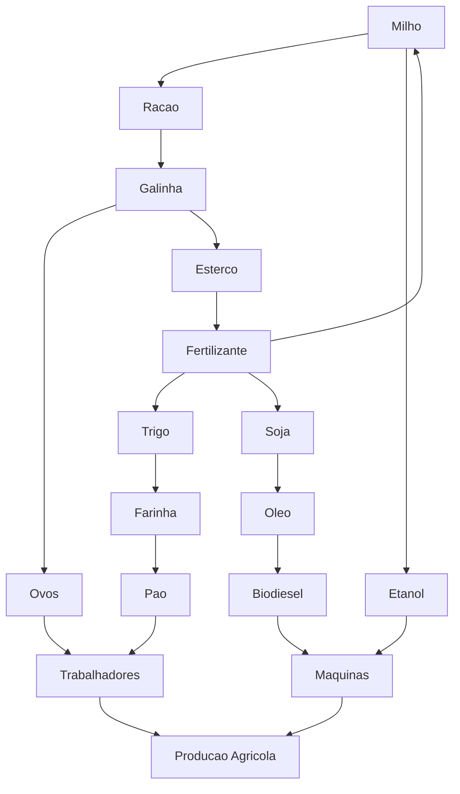

# Item Flow Diagram - Current Game Stage

This diagram represents the item and production-chain vision for the current stage of Capital Farm.

## Interpreting The Diagram

- `Trigo` can be processed into `Farinha`, which can be processed into `Pao`.
- `Milho` can be turned into `Racao`, which supports `Galinha`, which produces `Ovos`.
- `Pao` and `Ovos` support `Trabalhadores`.
- `Milho` can also generate `Etanol`.
- `Soja` can generate `Oleo`, which can become `Biodiesel`.
- `Etanol` and `Biodiesel` support `Maquinas`.
- `Galinha` also produces `Esterco`, which becomes `Fertilizante` and feeds crop production again.

## Design Use

This file is intended as a high-level production/economy reference for backend and Unity planning. It is not the source of truth for balancing values or implementation details.
